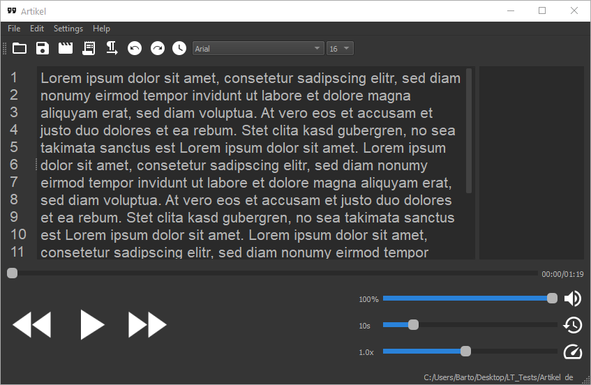

<p align="center">
  <a href="" rel="noopener">
 </a>
</p>

<h1 align="center">LazyTranscript</h1>

### Description
LazyTranscript was developed in a master thesis and tries to simplify the transcription of audio and video material with the help of DeepSpeech and various plug-ins.
Through various plug-ins, the editor tries to reduce the effort required to correct the errors in the transcription generated by DeepSpeech.

<p align="center">
  <a href="" rel="noopener">
 </a>
</p>

### Installation and usage

0. Read the [manual](assets/docs/manual.pdf) 
1. Clone this repository
2. Install [Python 3.8](https://www.python.org/downloads/)
3. Install the requirements 
   ```
   pip install -r requirements.txt
   ```
3. Remove unwanted plug-ins from the plug-ins directory. Look at the next section for more details about the plug-ins.
4. For each remaining plug-in, run the following command in the respective plug-in folder
    ```
   pip install -r requirements.txt
   ```
5. Install a DeepSpeech model, see: section 2 in the [manual](assets/docs/manual.pdf) 
6. Start LazyTranscript with
    ```
    python main.py
    ```
7. Edit the Transcription manually or use the word by word editing mode, see [manual](assets/docs/manual.pdf)  section 6.5

### Preinstalled plug-ins
1. word: This plug-in allows you to prepend, append, capitalize, replace, concat or remove words in the word by word editing mode.
2. words_to_number: This plug-in converts words to the number which they represents. Supports only english and german.
3. add_special_character: This plug-in allows you to append {. , ! ? ( )} to each word in the word by word editing mode.
4. lemmatization: This plug-in adds a toolbar-button which try to capitalize every noun. Currently supports only german.
5. deepspeech_alternatives: This plug-in shows alternative words from deepspeech in the word by word editing mode.
6. vosk_alternatives: This plug-in shows alternative words from [vosk](https://alphacephei.com/vosk/) in the word by word editing mode. In order to use this plug-in you need to download a model for your language and unzip it in the vosk_alternatives/model folder.
7. umlauts: This plug-in adds a toolbar-button which try to replace all spelled out umlauts 
8. language_tool_correction: This plug-in shows correction from a locally running languagetool-server. In order to use this plug-in you need to download the [language-server](https://dev.languagetool.org/http-server) and unzip it in language_tool_correction/language_tool/server. 
To improve the results, the [n-gram models](https://dev.languagetool.org/finding-errors-using-n-gram-data) can optionally be installed. They simply have to be unpacked to language_tool/n-gram/<LANGUAGE_TAG>.
9. summary: This plug-in adds a toolbar-button that displays a summary of the current transcription.
10. fake_data: This plug-in shows fake data in the word by word editing mode. This could be useful to remove any personal information.
11. readability: This plug-in adds a toolbar-button that display the current readybility after flesch-reading-ease.

### Support
If you find any problems or need help, just open an issue.

### Roadmap
In the future i would like to implement
1. Forced alignment, to map the transcription to the audio
2. SRT export to create subtitles from the transcription

### Contributing
[](https://egghead.io/courses/how-to-contribute-to-an-open-source-project-on-github) 

If you want to make some improvements or create a own plug-in: see [CONTRIBUTING.md](CONTRIBUTING.md) for more information.

### Acknowledgment
Thanks to DANBER for the awesome [deepspeech models](https://gitlab.com/Jaco-Assistant/deepspeech-polyglot). 

### License
This Project is licenced unter [GPLv3](COPYING.txt).

